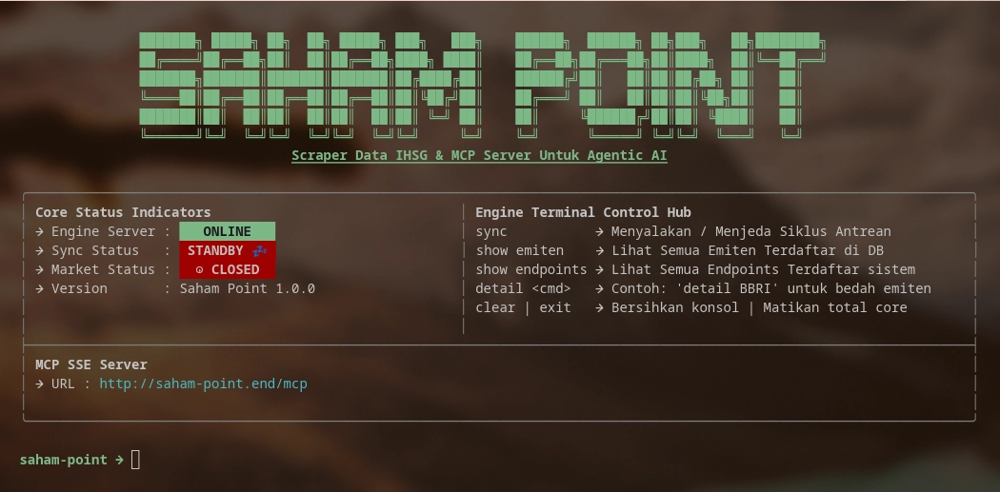

<div align="center">

<pre style="color: #83f496; font-weight: bold; background-color: transparent; border: none; margin-bottom: 0;">
███████╗ █████╗ ██╗  ██╗ █████╗ ███╗   ███╗    ██████╗  ██████╗ ██╗███╗   ██╗████████╗
██╔════╝██╔══██╗██║  ██║██╔══██╗████╗ ████║    ██╔══██╗██╔═══██╗██║████╗  ██║╚══██╔══╝
███████╗███████║███████║███████║██╔████╔██║    ██████╔╝██║   ██║██║██╔██╗ ██║   ██║   
╚════██║██╔══██║██╔══██║██╔══██║██║╚██╔╝██║    ██╔═══╝ ██║   ██║██║██║╚██╗██║   ██║   
███████║██║  ██║██║  ██║██║  ██║██║ ╚═╝ ██║    ██║     ╚██████╔╝██║██║ ╚████║   ██║   
╚══════╝╚═╝  ╚═╝╚═╝  ╚═╝╚═╝  ╚═╝╚═╝     ╚═╝    ╚═╝      ╚═════╝ ╚═╝╚═╝  ╚═══╝   ╚═╝   
</pre>

<h2 style="font-family: 'Courier New', Courier, monospace; margin-top: -5px; color: #83f496;"> 
  Scrapper IHSG Data & Endpoint API for Agentic AI
</h2>



<div style="text-align: center; max-width: 1000px; line-height: 1.6; font-size: 12px">
  
Proyek ini adalah aplikasi komprehensif yang berfungsi sebagai <b>Command Line Interface (CLI)</b> dan <b>API Gateway</b>. Tujuannya adalah untuk mengambil, memproses, dan memantau data pasar saham secara <i>real-time</i> dari berbagai sumber. Aplikasi ini menyediakan pembaruan status melalui Antarmuka Pengguna Berbasis Teks (TUI), serta menyediakan serangkaian API RESTful yang kaya fitur untuk analisis mendalam.

</div>
</div>

<div align="center">

<h2 style="font-family: 'Courier New', Courier, monospace; color: #fdf6e3; border-bottom: 2px solid #fdf6e3; display: inline-block; padding-bottom: 5px;">
  🚀 FITUR UTAMA
</h2>

<div style="text-align: center; display: inline-block; margin-top: 20px;">

◈ **CLI Interaktif**  
 &nbsp;&nbsp;&nbsp;&nbsp;_Menyediakan antarmuka baris perintah dengan kemampuan live monitoring dan manajemen data._

◈ **API Gateway**  
 &nbsp;&nbsp;&nbsp;&nbsp;_Menawarkan berbagai endpoint RESTful API untuk akses data terprogram, termasuk profil saham & analisis teknikal._

◈ **Data Scraping Otomatis**  
 &nbsp;&nbsp;&nbsp;&nbsp;_Menggunakan scraper untuk mengambil data fundamental dan harga secara terjadwal (cron)._

◈ **Database Persisten**  
 &nbsp;&nbsp;&nbsp;&nbsp;_Mengelola data pasar saham menggunakan database internal dengan riwayat tahunan._

◈ **Fitur Analisis Lanjutan**  
 &nbsp;&nbsp;&nbsp;&nbsp;_Menyediakan endpoint api khusus untuk screener lanjutan seperti Value Investing, Growth Screener, dan Dividend Hunters._

</div>
</div>

<div align="center">

<h2 style="font-family: 'Courier New', Courier, monospace; color: #fdf6e3; border-bottom: 2px solid #fdf6e3; display: inline-block; padding-bottom: 5px;">
  🛠️ PENGATURAN & INSTALASI
</h2>

<div style="text-align: center; max-width: 1000px; line-height: 1.6; font-size: 12px; margin: 0 auto;">

Proyek ini dibangun dengan <b>Bun</b> dan <b>TypeScript</b>. Pastikan kamu sudah memiliki <a href="https://bun.sh/">Bun</a> di sistemmu.

</div>

<div style="text-align: left; display: inline-block; margin-top: 20px;">

◈ **1. Instalasi Dependensi**  
 &nbsp;&nbsp;&nbsp;&nbsp;_Jalankan perintah berikut untuk mengunduh semua kebutuhan proyek:_

```bash
bun install
```

◈ **2. Menjalankan Aplikasi**  
 &nbsp;&nbsp;&nbsp;&nbsp;_Gunakan skrip `point` yang didefinisikan dalam `package.json` untuk menjalankan aplikasi:_

```bash
bun point
```

</div>
</div>

<div align="center">

<h2 style="font-family: 'Courier New', Courier, monospace; color: #fdf6e3; border-bottom: 2px solid #fdf6e3; display: inline-block; padding-bottom: 5px;">
  ⚙️ PENGGUNAAN & PERINTAH (CLI)
</h2>

<div style="text-align: center; max-width: 1000px; line-height: 1.6; font-size: 12px; margin: 0 auto 20px;">

Aplikasi ini mendukung beberapa perintah utama melalui TUI-nya:

</div>

<div style="text-align: left; display: inline-block;">

◈ **`sync`**  
 &nbsp;&nbsp;&nbsp;&nbsp;_Memulai siklus sinkronisasi data fundamental dan harga pasar secara otomatis. Proses ini berjalan di latar belakang dengan progress bar._

◈ **`detail <kode>`**  
 &nbsp;&nbsp;&nbsp;&nbsp;_Mengambil profil lengkap saham, termasuk ringkasan metrik finansial dan riwayat historis 5 tahun._

◈ **`show emiten`**  
 &nbsp;&nbsp;&nbsp;&nbsp;_Mendaftar semua kode emiten yang tersimpan di database beserta status pembaruan data terakhirnya._

◈ **`show endpoints`**  
 &nbsp;&nbsp;&nbsp;&nbsp;_Menampilkan daftar dinamis semua endpoint API yang tersedia pada server._

◈ **`clear` / `exit`**  
 &nbsp;&nbsp;&nbsp;&nbsp;_Mengontrol tampilan dan menghentikan aplikasi._

</div>
</div>

<div align="center">

<h2 style="font-family: 'Courier New', Courier, monospace; color: #fdf6e3; border-bottom: 2px solid #fdf6e3; display: inline-block; padding-bottom: 5px;">
  📚 PANDUAN DOKUMENTASI PROYEK MENDALAM (ARSITEKTUR)
</h2>

<div style="text-align: center; max-width: 1000px; line-height: 1.6; font-size: 12px; margin: 0 auto 20px;">

Bagian ini memberikan rincian mendalam tentang arsitektur sistem, membagi fungsionalitas menjadi tiga pilar utama.

</div>

<div style="text-align: left; display: inline-block; max-width: 900px;">

◈ **1. Pilar Data Scraping & Persistence**  
 &nbsp;&nbsp;&nbsp;&nbsp;_Alur Kerja:_ Proses data dimulai dari `src/scrapper/index.ts` yang menjadwalkan pengambilan harga real-time (`syncMarketPrices`) dan sinkronisasi fundamental secara massal (`syncDataAll`).  
 &nbsp;&nbsp;&nbsp;&nbsp;_Database Schema:_ Struktur database di `src/db/index.ts` menyimpan data emiten utama, serta tabel terpisah untuk riwayat finansial tahunan (`stock_histories`), memungkinkan analisis historis mendalam.

◈ **2. Pilar API Gateway (Backend)**  
 &nbsp;&nbsp;&nbsp;&nbsp;Semua fungsionalitas canggih diekspos melalui API Gateway di `src/server.ts`.

&nbsp;&nbsp;&nbsp;&nbsp;— **Endpoint Profil Saham**: `/api/saham/:code` menyediakan data fundamental lengkap dan riwayat historis 5 tahun.  
&nbsp;&nbsp;&nbsp;&nbsp;— **Screener Cerdas**: Tersedia beberapa endpoint untuk penyaringan saham berdasarkan kriteria investasi spesifik:

- **Value Screener** (`/screener/undervalued`) — Menyaring emiten dengan rasio PBV, ROE, dan DER yang sehat.
- **Growth Screener** (`/screener/growth`) — Mendeteksi pertumbuhan laba bersih konsisten dari tahun ke tahun.
- **Dividend Hunters** — Fokus pada saham pembagi dividen tinggi dengan manajemen utang yang aman.
- **Technical Screener** (`/api/technical/:code`) — Memungkinkan pengambilan data historis candlestick (OHLCV) untuk analisis teknikal.

◈ **3. Pilar CLI & TUI**  
 &nbsp;&nbsp;&nbsp;&nbsp;CLI berfungsi sebagai antarmuka pengguna utama, memanfaatkan `src/cli/tui-engine.ts` dan `src/cli/command.ts` untuk menampilkan status sistem secara real-time melalui TUI yang interaktif.

</div>
</div>

<hr style="border: 1px solid #fdf6e3; opacity: 0.3; margin: 30px 0;">

<div align="center" style="font-size: 14px; opacity: 0.85;">

@2026. Saham Point Scrapper IHSG Data & Endpoint API for Agentic AI

</div>
